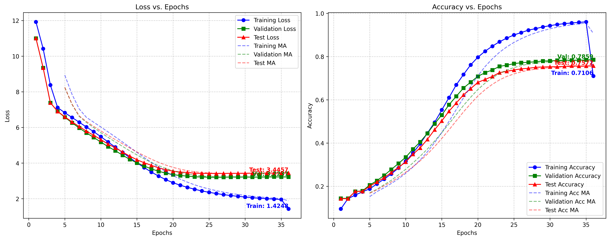

# deepseekv3-minimal
Creating the DeepSeek V3 model from scratch

## Purpose
Learning the architecture of DeepSeek V3 can be challenging. To understand it, the surrounding mechanisms of training, floating point (8 bit) optimizations etc
are not required. Therefore, to make things simple, this repo exists. 

* Multi Token Prediction
* Mixture of experts with controllable number of active experts
* Transformers (obviously)
* Key-Value-Query compression
* Basic training loops
* Greedy, sampled, and MTP based text generation
* Minimal code make everything work 
* Not everything will be here according to their paper, other sources or open source implementation.
* This is purely a personal effort 

## Slow training!
The architecture is not optimized and it very slow to train. 
Reduce the dataset or make the model less complex for faster training. :)

## Architecture of DeepSeek V3

## Training on Youtube comments dataset

## Datasets
[Youtube Comments](https://www.kaggle.com/datasets/atifaliak/youtube-comments-dataset/data)

[Huggingface Wikipedia](https://huggingface.co/datasets/legacy-datasets/wikipedia/tree/main/data/20220301.simple)

