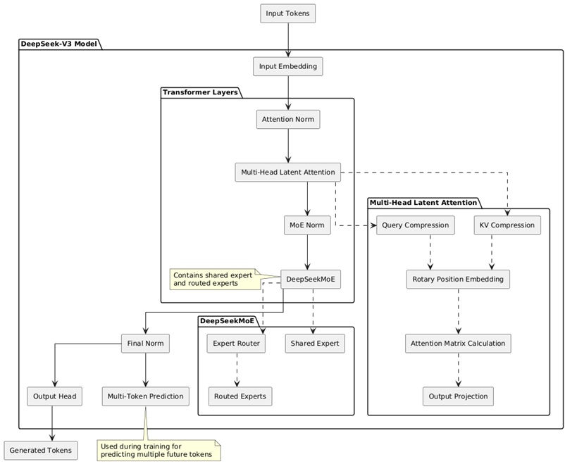
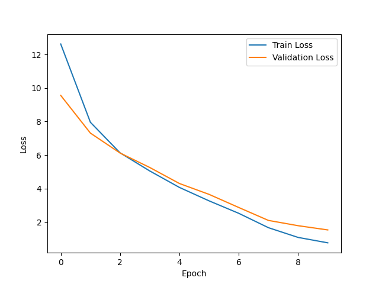

# deepseekv3-minimal
Creating the DeepSeek V3 model from scratch

# Please note this is a work in progress!

## Purpose
Learning the architecture of DeepSeek V3 can be challenging. To understand it, the surrounding mechanisms of training, floating point (8 bit) optimizations etc
are not required. Therefore, to make things simple, this repo exists. 

* Multi Token Prediction
* Mixture of experts with controllable number of active experts
* Transformers (obviously)
* Key-Value-Query compression
* Basic training loops
* Basic text generation
* Minimal code make everything work 

## Architecture of DeepSeek V3

## Training on 20220301.simple wikipedia

